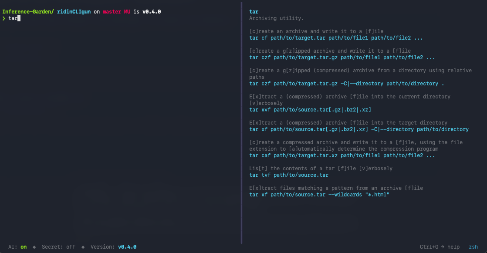
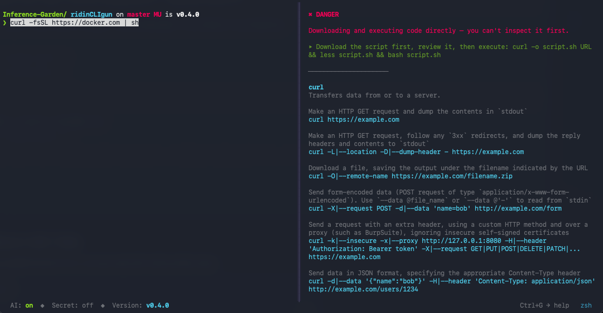
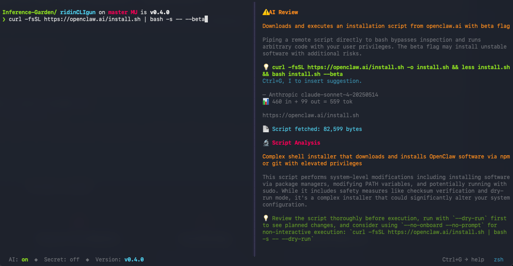
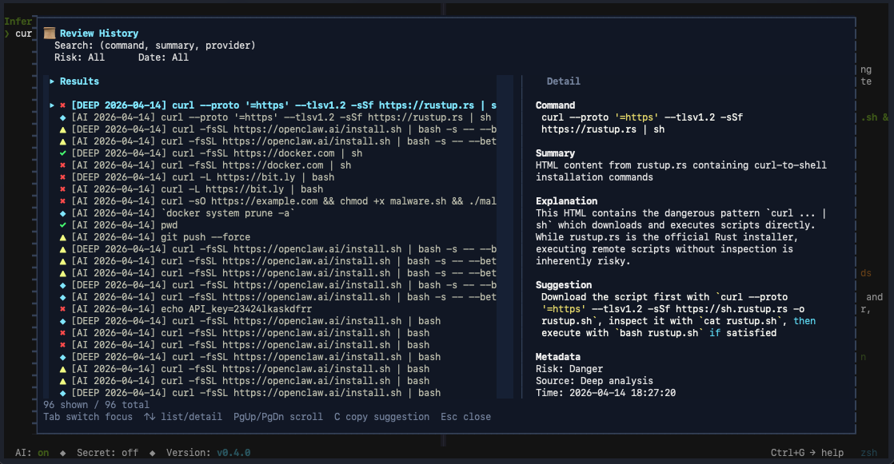

# ridinCLIgun

> Your terminal copilot that watches, warns — and knows the commands.



ridinCLIgun splits your terminal in two: a **real shell** on the left, an **advisory pane** on the right. Type anything — it watches in real time, warns you before you run something you'll regret, and shows you what the command actually does.

The advisory pane already knows **6,600+ commands offline**. It shows examples, explains common usage, and catches typos without any API key.

Add an AI backend and it goes further: review risky commands, inspect `curl | bash`-style install flows, and suggest safer alternatives — in your language.

**You drive. It rides shotgun. And it knows the roads.**

## What it does

**Instant local analysis — no AI, no internet, no waiting:**

- **Risk warnings** — offline pattern matching catches dangerous commands as you type
- **Command knowledge** — 6,600+ commands with descriptions and real usage examples
- **Typo detection** — "Did you mean `git`?" when you type `gti`
- **Real shell** — full PTY with colors, tab completion, history, and scrollback

**With AI enabled (opt-in, explicit trigger):**

- **AI command review** — ask Claude, GPT, or Mistral to review what you're about to run
- **Deep script analysis** — fetches and analyzes remote scripts from `curl | bash`-style patterns
- **AI suggestions** — safer alternatives you can insert directly into the shell

**Privacy and safety controls:**

- **Secret mode** — one toggle to block AI communication
- **Redaction preview** — shows what would be sent to the provider before a redacted command leaves your machine
- **Clipboard safety** — warns before pasting secret-looking content

**Usability features:**

- **Multi-language UI** — English, German, or French
- **History browser** — browse, search, and learn from past AI reviews
- **Settings menu** — configure AI, privacy, provider, and language from inside the app
- **Provider switching** — Anthropic, OpenAI, Mistral; the choice persists across restarts
- **Explorer mode** — gentler tone for beginners and kids

## What It Looks Like

### Local warning plus offline command help



### AI review plus deep script analysis



### Review history browser



## Why this exists

ridinCLIgun started as a first coding project after many years away from code. Much of it has been built in a deliberately AI-assisted, vibe-coded way as part of learning how modern tool-driven development actually works.

The terminal is where a lot of real learning happens: shells, scripts, package managers, LLM tooling, multi-agent workflows. But it is also where many people stop because it feels hostile, unforgiving, and one typo away from damage.

This project exists because the terminal should not be a gatekeeper. If you're curious enough to open one, you deserve a companion that helps you learn safely without taking control away from you.

See also the product page of [ridinCLIgun](https://inference-garden.dev/en/products/ridincligun.html).

## New to the terminal?

The command line is powerful — but unforgiving. There is no undo for many operations, and a typo in the wrong place can turn a useful command into a broken or destructive one.

ridinCLIgun is meant to make that environment more legible. If a command is risky, it tells you why before you run it. If a command is safe, it helps you understand what it does and how to use it.

## Prerequisites

| Requirement | Detail |
|-------------|--------|
| **Python** | `>= 3.12` |
| **OS** | macOS today |
| **Terminal** | Any terminal emulator with PTY support |
| **Shell** | Any POSIX shell — uses your default shell |

For AI-powered review you also need an API key from one of the supported providers. The local advisory features work without any API key.

## Quick Start

### Install via Homebrew (macOS — recommended)

```bash
brew tap inference-garden/ridincligun
brew install ridincligun
```

Then run `ridincligun`. This includes all three AI providers out of the box; the local
advisory features work without any API key. Upgrade later with `brew upgrade ridincligun`,
and uninstall with `brew uninstall ridincligun`.

The install pours a prebuilt bottle — it finishes in seconds and pulls no compiler
toolchain. If Homebrew refuses the tap with an untrusted-tap error (Homebrew 6 requires
explicit trust for third-party taps), run `brew trust inference-garden/ridincligun` and
retry.

### Install from source

```bash
git clone git@github.com:inference-garden/ridinCLIgun.git
cd ridinCLIgun

python3.12 -m venv .venv
source .venv/bin/activate
```

#### Install options

**a) Local-only** — offline advisory, no AI provider dependencies:

```bash
python -m pip install -e "."
```

**b) All providers** — install everything and decide later:

```bash
python -m pip install -e ".[all]"
```

**c) Pick one provider** — install only what you need:

```bash
python -m pip install -e ".[mistral]"
python -m pip install -e ".[anthropic]"
python -m pip install -e ".[openai]"
```

Then start the app:

```bash
ridincligun
```

## Setting Up AI Review

Add your API key to the config file created on first run:

```bash
echo "MISTRAL_API_KEY=your-key" >> ~/.config/ridincligun/.env
echo "ANTHROPIC_API_KEY=your-key" >> ~/.config/ridincligun/.env
echo "OPENAI_API_KEY=your-key" >> ~/.config/ridincligun/.env
```

Or enter keys from inside the app through Settings.

Useful controls:

- `F4` — toggle AI on/off
- `Ctrl+G, M` — switch provider/model
- `Ctrl+G, G` — open settings
- `Ctrl+G, C` / `Ctrl+G, V` — copy selection / paste (scanned for secrets first)

## Shortcuts

Frequent actions live on function keys. Modal actions use `Ctrl+G` as a leader key.

| Key | What it does |
|-----|--------------|
| `F1` | Show shortcut help |
| `F2` | Review current command / confirm redacted send |
| `F3` | Insert the last AI suggestion |
| `F4` | Toggle AI on/off |
| `F5` | Toggle Secret Mode |
| `F9` | Give more space to the advisory pane |
| `F10` | Give more space to the shell pane |
| `Ctrl+G, H` | Open review history |
| `Ctrl+G, M` | Switch provider/model |
| `Ctrl+G, G` | Open settings |
| `Ctrl+G, C` | Copy the current selection to the clipboard |
| `Ctrl+G, V` | Paste — scanned for secrets, with confirmation before it reaches the shell |
| `Ctrl+G, X` | Restart shell |
| `Ctrl+G, Q` | Quit |

## Status

**v0.4.5** — current line. macOS, Python 3.12+.

Homebrew install landed in v0.4.5; the next steps in the v0.4.x line are polish and Linux support — not a new product direction.

## Config

`~/.config/ridincligun/` is created automatically on first run.

- `config.toml` — UI, provider, language, and privacy settings
- `.env` — API keys, kept local with `0600` permissions
- `history.jsonl` — local review history

Full details: [Configuration](docs/configuration.md)

## Documentation

| Document | What it covers |
|----------|----------------|
| [Security Model](docs/security.md) | Data flow, local storage, controls, and known limits |
| [Command Analysis](docs/command_analysis.md) | What is checked locally, what triggers AI review, and Layer 3 coverage |
| [Configuration](docs/configuration.md) | Config files, settings, persistence, and provider/model presets |
| [Prompt Category System](docs/prompt_category_system.md) | How Layer 2 prompt composition works today |
| [Roadmap](docs/roadmap.md) | Public direction of the project |

## Development

```bash
python -m pip install -e ".[dev]"
pytest tests/ -q
ruff check src/ tests/
```

For security-relevant changes it is also worth running:

```bash
bandit -r src/ridincligun/ -c pyproject.toml
pip-audit
```

## Command Catalog

The offline command knowledge comes from [tldr-pages](https://github.com/tldr-pages/tldr) (v2.3, MIT license) — a community-maintained database of practical command examples.

The catalog currently bundles 6,615 commands across common, Linux, and macOS platforms, including German and French overlays. It ships as local JSON data — no network access is required at runtime.

## Contributing

Bug reports, security review, and small focused fixes are very welcome — see [CONTRIBUTING.md](CONTRIBUTING.md).

## License

GPL-3.0-or-later — see [LICENSE](LICENSE)
